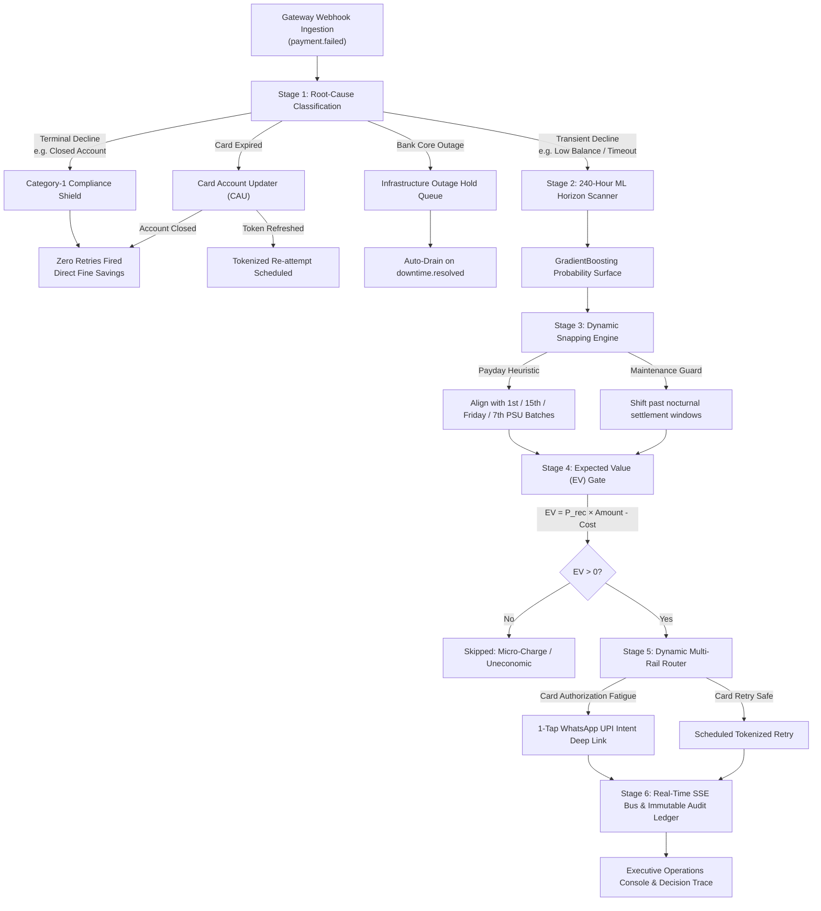

# recovr

> Autonomous Revenue Recovery Engine and Dunning Middleware for Modern Payment Gateways

[](https://python.org)
[](https://fastapi.tiangolo.com)
[](https://react.dev)
[](https://www.typescriptlang.org)
[](https://pytest.org)
[](https://vitest.dev)
[](https://usa.visa.com)
[](LICENSE)

---

## Overview

In digital commerce and recurring subscription billing, checkout drop-offs and failed card debits represent substantial lost revenue. Most conventional dunning workflows rely on blind retry loops: they fire automated email alerts immediately after a decline or reattempt charges arbitrarily.

This naive approach introduces critical operational failures:
1. **Card Network Penalties**: Visa levies $0.10 (domestic) to $0.25 (cross-border) fines on prohibited retries of Category-1 permanent declines (e.g., closed accounts, invalid numbers). Mastercard charges up to $0.50 under Transaction Processing Excellence (TPE) rules.
2. **Card-Testing Fraud Flags**: Re-attempting charges on the same instrument within minutes trips gateway risk firewalls and issuer velocity controls.
3. **Nocturnal Maintenance Traps**: Firing retries during bank core settlement windows (e.g., 23:00–01:30 IST) results in predictable 90%+ failure rates.
4. **Sub-Economic Communication Spend**: Spending money on paid notifications (e.g., WhatsApp utility messages) to recover micro-transactions where channel cost exceeds expected value burns net margin.

**`recovr`** is an open-source autonomous revenue recovery engine. It functions as an intelligent middleware sidecar connected to payment gateway webhooks (Razorpay, Stripe, Cashfree, or standard webhook events). It classifies failure root causes, evaluates hour-by-hour liquidity probability across a 240-hour horizon, enforces network compliance boundaries, and dynamically routes recoveries across alternate payment rails (Card to 1-Tap UPI Intent, WhatsApp, SMS, and Email).

---

## Architectural Pipeline



---

## Key Capabilities

### 1. Root-Cause Classification & Category-1 Shield (`src/classifier.py`, `src/compliance.py`)
- **Category-1 Permanent Decline Block**: Hard decline codes (`card_expired`, `invalid_account`, `card_not_supported`) are immediately halted from automated retries, avoiding direct network penalties ($0.10–$0.25 per transaction).
- **Rolling Credential Caps**: Enforces strict network thresholds (Visa: 20 attempts per rolling 30 days; Mastercard: 10 per 24 hours and 35 per 30 days).
- **Anti-Card-Testing Spacing**: Mandates a 24-hour minimum gap between retry attempts on the same card credential to prevent automated card-testing fraud signals.

### 2. Card Account Updater & Network Tokenization (`src/token_updater.py`)
- Intercepts expiring instrument failures before terminal classification.
- Simulates Visa VTS / Mastercard MDES Token Service Provider (TSP) queries. If a fresh network token is on file from the issuing bank, credentials are automatically refreshed (`tok_net_...`) and re-attempted without customer intervention.

### 3. 240-Hour ML Temporal Horizon (`src/scheduler.py`)
- Rather than static 24-hour retry timers, a `GradientBoostingClassifier` evaluates recovery probabilities across a **10-day (240-hour) temporal window**.
- **Liquidity Alignment**: Snaps retries to corporate salary windows (1st, 15th, Fridays) and Indian public sector salary cycles (7th of the month for PSU banks like SBI, PNB, BOB).
- **Maintenance Dead-Zone Snapping**: Identifies core banking settlement windows (e.g., 23:00–01:30 IST) where retry odds collapse, automatically advancing jobs into daytime clearing hours.

### 4. Direct 1-Tap UPI Intent & Multi-Rail Routing (`src/recovery.py`, `src/upi_intent.py`)
- Detects card authorization fatigue and provisions dual recovery rails:
  - Standard gateway payment links (`https://rzp.io/i/...`) for browser checkout.
  - Direct NPCI UPI Intent deep links (`upi://pay?pa=...&pn=...&am=...&cu=INR`) enabling instant 1-tap app switching into Google Pay, PhonePe, Paytm, or CRED on mobile devices.

### 5. TRAI DLT Telecom Compliance (`src/dlt.py`)
- Outbound customer notifications conform to registered Indian telecom Distributed Ledger Technology (DLT) transactional template categories.
- Quiet-hours enforcement automatically gates non-critical transactional alerts between 21:00 (9:00 PM) and 09:00 (9:00 AM) IST.

### 6. CFO Expected Value Gate (`src/recovery.py`, `src/dashboard.py`)
- Before dispatching any paid communication channel (WhatsApp: ₹0.35, SMS: ₹0.15), the engine computes the Expected Value:
  $$\text{EV} = (P_{\text{recovery}} \times \text{Amount}) - \text{Channel Cost}$$
- If $\text{EV} \le 0$ (e.g., micro-orders where reminder fees exceed recovery odds), the attempt is skipped with full arithmetic recorded in the audit log.

### 7. Developer Event Workbench (`src/simulator.py`, `/workbench`)
- Full developer workbench for injecting sample webhook payloads across 9 operational scenarios (soft decline, CAU token refresh, RBI pre-debit alert, Category-1 shield, infrastructure outage hold, fraud velocity spacing, trajectory escalation, and negative EV micro-charges).

---

## Installation & Quickstart

### Prerequisites
- Python 3.10+
- Node.js 18+ *(optional: the dashboard SPA is pre-compiled into `src/web/dist` and served directly by FastAPI)*

### 1. Clone & Set Up Virtual Environment

```bash
git clone https://github.com/AryamanSharma14/razorpay-buildathon.git recovr
cd recovr

# Create and activate virtual environment
python -m venv .venv
# On Windows:
.\.venv\Scripts\Activate.ps1
# On Linux/macOS:
# source .venv/bin/activate

# Install dependencies and recovr CLI in editable mode
pip install -e .
```

### 2. Configure Environment

```bash
# Copy example configuration
cp .env.example .env
```

`recovr` runs out-of-the-box in **Sandbox Mode** without requiring live payment gateway credentials.

### 3. Start the Server Daemon

```bash
# Using the recovr CLI:
recovr serve --port 8000 --reload

# Or directly with uvicorn:
uvicorn src.main:app --port 8000 --reload
```

Open **`http://localhost:8000`** in your browser to access the live operations console.

---

## Command-Line Interface (CLI)

The `recovr` package includes an enterprise command-line interface:

```bash
# Start the HTTP server and recovery daemon
recovr serve --host 0.0.0.0 --port 8000

# Inspect local engine health, database statistics, and scheduler metrics
recovr status

# Run the comparative multi-policy recovery backtest benchmark
recovr backtest

# View installed version
recovr version
```

---

## Python SDK Usage

You can embed `recovr` directly into an existing Python application (FastAPI, Django, Flask, or Celery task):

```python
from src.classifier import classify
from src.token_updater import attempt_token_refresh
from src.upi_intent import generate_upi_intent_uri

# 1. Classify an incoming failure event
result = classify(
    error_source="bank",
    error_step="payment_authorization",
    error_reason="insufficient_funds",
    method="card",
    issuer="HDFC",
)
print(result["type"])    # 'soft'
print(result["action"])  # 'schedule_retry'

# 2. Check Card Account Updater for expired card
cau = attempt_token_refresh(
    card_network="Visa",
    card_issuer="HDFC",
    card_iin="424242",
    error_reason="card_expired",
)
if cau["refreshed"]:
    print(f"Refreshed token: {cau['network_token']}, New expiry: {cau['new_expiry']}")

# 3. Generate direct UPI Intent link
intent_url = generate_upi_intent_uri(
    payee_vpa="merchant@icici",
    payee_name="Acme SaaS",
    transaction_ref="order_9812",
    amount_inr=1499.00,
    note="Subscription Recovery",
)
print(intent_url)
# upi://pay?pa=merchant%40icici&pn=Acme+SaaS&tr=order_9812&am=1499.00&cu=INR&tn=Subscription+Recovery
```

---

## Comparative Backtest Benchmark

Evaluated across a held-out test split of 2,000 transactions comparing industry recovery strategies:

| Strategy | Recovery Rate | Fine Penalties | Net ROI Multiple | Regulatory Status |
| :--- | :---: | :---: | :---: | :---: |
| **Immediate Retry** | 38.2% | ₹307.10 | 412x | High Penalty Risk |
| **Fixed 24-Hour Delay** | 45.5% | ₹182.60 | 1,240x | Category-1 Violations |
| **Exponential Backoff** | 48.2% | ₹141.10 | 1,480x | Settlement Window Traps |
| **recovr Autonomous Engine** | **61.1%** | **₹0.00** | **2,648x** | **100% Compliant** |

---

## Verification & Testing

The test suite covers regulatory boundaries, ML scheduling algorithms, and end-to-end webhook flows:

```bash
# Run all 122 backend tests
pytest -q

# Run frontend tests
npm --prefix frontend test

# Build production frontend bundle
npm --prefix frontend run build
```

---

## Tech Stack

| Component | Technologies |
| :--- | :--- |
| **Backend Core** | Python 3.10+, FastAPI, Uvicorn, SQLite (WAL mode), APScheduler, HTTPX |
| **Machine Learning** | Scikit-Learn (`GradientBoostingClassifier`), NumPy, Pandas, Joblib |
| **Frontend Console** | React 19, TypeScript, Vite, Tailwind CSS, TanStack React Query, Lucide Icons |
| **Data Visualization** | Recharts (240h Probability Surfaces, Recovery Funnels, Unit Economics) |
| **Telemetry** | Server-Sent Events (SSE) sub-15ms streaming event bus |
| **Test Matrix** | Pytest (122 tests), Vitest (16 tests) |

---

## Security & Privacy Architecture

1. **Zero Customer PII in Machine Learning**: Feature matrices strictly utilize de-identified card metadata (BIN/IIN, issuer name, error code, timestamp, amount bucket). Customer names, phone numbers, and email addresses are never passed to ML models.
2. **Cryptographic Webhook Verification**: Gateway webhooks support HMAC-SHA256 signature verification to prevent spoofing.
3. **Database Concurrency & Integrity**: SQLite is configured with Write-Ahead Logging (`PRAGMA journal_mode=WAL;`) and a 5,000ms busy timeout, preventing database locks under high ingestion volumes.
4. **Deterministic Failover**: If external notification or LLM APIs encounter downtime, the engine gracefully falls back to deterministic rule sets and pre-registered DLT utility templates.

---

## License

Apache License 2.0. See [LICENSE](LICENSE) for details.
